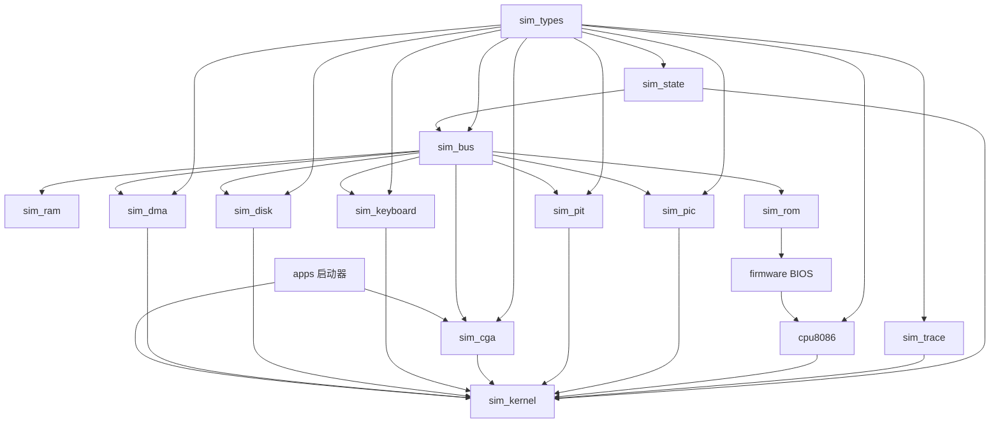

# 模块依赖图

## 读法

实线表示运行时依赖。虚线表示验证关系。

## 当前总图

## 分层

- 基础层：`sim_types`、`sim_state`、`sim_trace`
- 调度层：`sim_kernel`、`sim_bus`
- 存储层：`sim_ram`、`sim_rom`
- 处理器层：`cpu8086`
- 外设层：`sim_pic`、`sim_pit`、`sim_cga`、`sim_keyboard`、`sim_disk`、`sim_dma`
- 软件层：BIOS、DOS
- 宿主层：启动器

